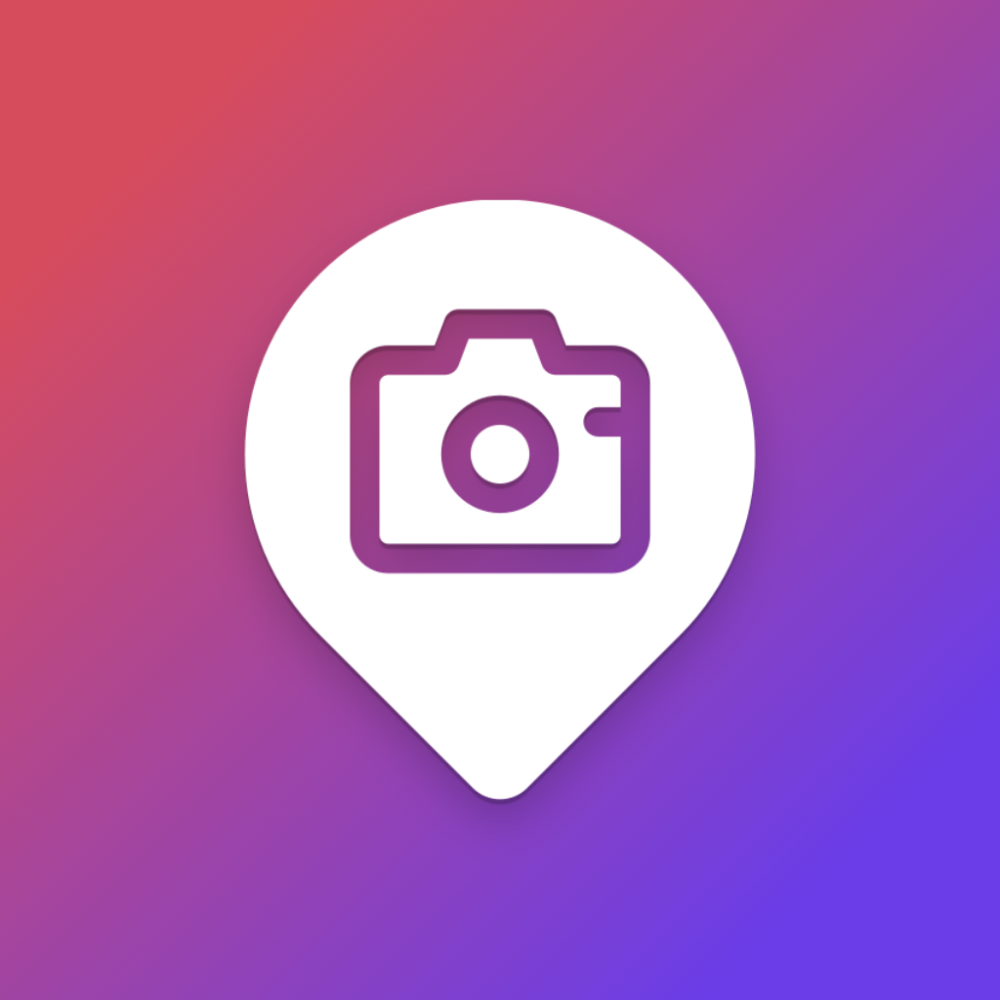

#  LocationAlpha

**Reliable geotagging for Sony cameras** — works in background, automatically pushes GPS data to your camera.

---

A lightweight iOS app that connects to Sony cameras via Bluetooth and keeps them updated with your phone's location — so every photo is automatically geotagged without any manual work.

## Features

- **Background operation** — connects to camera as soon as you turn it on, even when the app is minimized
- **Automatic reconnection** — reconnects and pushes location updates as you move
- **Multi-camera support** — connect one or more cameras simultaneously
- **GPX export** — location history can be exported to GPX files

## Supported Cameras

Works with Sony cameras supporting **Location Info Link** (compatible with Sony Creators app). Always keep your camera on the latest firmware.

| Model | Designation |
|---|---|
| Sony α1 | ILCE-1 |
| Sony α1 II | ILCE-1M2 |
| Sony α9 III | ILCE-9M3 |
| Sony α7R V | ILCE-7RM5 |
| Sony α7S III | ILCE-7SM3 |
| Sony α7 IV | ILCE-7M4 |
| Sony α7CR | ILCE-7CR |
| Sony α7C II | ILCE-7CM2 |
| Sony α6700 | ILCE-6700 |
| Sony ZV-E1 | ZV-E1 |
| Sony ZV-E10 II | ZV-E10M2 |
| Sony ZV-1 II | ZV-1M2 |
| Sony ZV-1F | ZV-1F |
| Sony FX3 | ILME-FX3 |
| Sony FX30 | ILME-FX30 |

Other models with Location Info Link may also work.

## Building

Requirements:

- **Xcode 26+**
- iOS 26+ SDK
- Swift 6.0+

## Contributing

This project has a specific vision and is actively maintained by a single developer. To keep things focused and stable, contributions follow a strict process.

1. **Open an issue first** — before writing any code, create an issue describing what you want to do (bug fix, feature, improvement). Wait for feedback.
2. **Discuss and agree** — the issue must be reviewed and approved before any work begins. Not all suggestions will be accepted.
3. **No unsolicited PRs** — pull requests submitted without a prior approved issue will be closed.
4. **Follow the existing style** — match the code style, architecture, and conventions already in use.
5. **Keep it minimal** — prefer small, focused changes over large rewrites.

*LocationAlpha is not sponsored or affiliated with Sony Corporation. Sony, α, Alpha, Cyber-shot, NEX, RX are trademarks of Sony Corporation.*
